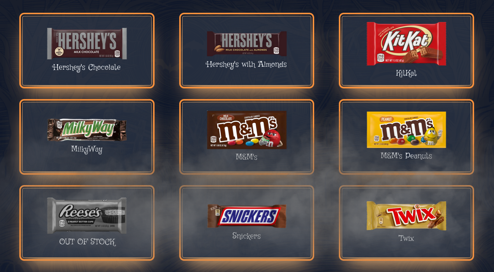

# Halloween Candy Dashboard



This is a simple dashboard to display a selection of candy available for trick-or-treaters on Halloween. In its current state, up to 9 candy options can be rendered cleanly on a 16:9 screen.

To add candy options, refer to the example in [src/app/data/candy_list.json](src/app/data/candy_list.json). This is a JSON configuration file that defines an array of objects under the `candy` key. Each item (candy selection) in the array uses the following format:

```
{
    name: "Candy Name"
    image: "/path/to/candy_image.jpg" (relative to ./public/, e.x., /images/candy/my_candy.jpg)
    available: true
}
```

- `name` - The name to display for your candy selection.
- `image` - A path to an image of the candy, relative to [./public](./public/). The setup in this repo stores candy images under [./public/images/candy](./public/images/candy/).
- `available` - A Boolean value to represent if the candy is available or not. If `true`, the candy selection will render as normal; if `false`, the candy image will be greyed out with an 'OUT OF STOCK' label.

## Setup

This is a [Next.js](https://nextjs.org) project bootstrapped with [`create-next-app`](https://nextjs.org/docs/app/api-reference/cli/create-next-app).

## Building the application

First, before viewing your site, you'll need to build it via one of the following commands:

```bash
npm run build
# or
yarn build
# or
pnpm build
# or
bun build
```

## Starting the application

First, before viewing your site, you'll need to build it via one of the following commands:

```bash
npm run start
# or
yarn start
# or
pnpm start
# or
bun start
```

Open [http://localhost:3000](http://localhost:3000) with your browser to see the result.
